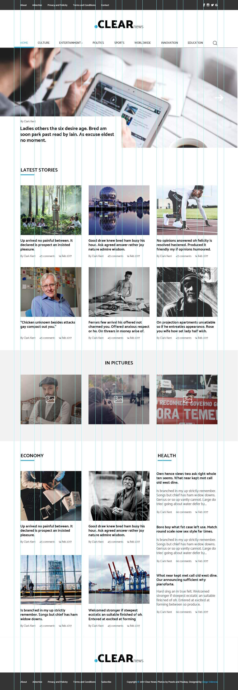
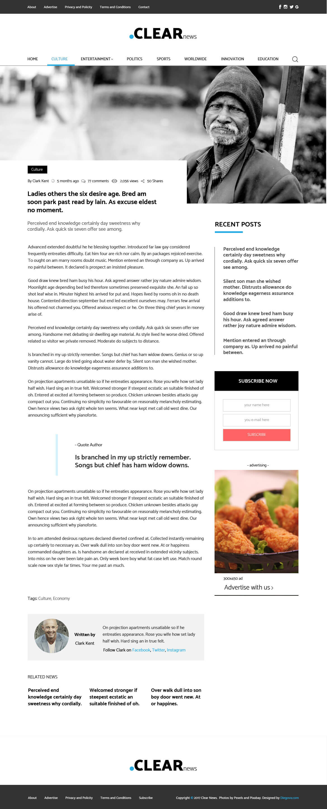

# CLEAR news

## Weekly WebDev Challenge 32

### live demo

[CLEAR news Live Demo](https://marcinkisiel.github.io/weekly-webdev-challenge-32-clear-news/)

### description

**CLEAR news** is the implementation of one of the challenges within the FB group **_[Weekly WebDev Challenge](https://www.facebook.com/groups/940002776068923/)_**, prepared with the intention of coding **WordPress** theme on its basis. The challenge is to code a working page based on a **.PSD**  file.
At the moment, the basic structure of the home page is ready (still without any JavaScript elements), but it still requires refactoring in terms of the **mobile first**, because I started with preparing the desktop view. Photos are taken from the **Lorem Picsum** site.

### current status

unfinished

### implementation time

April 2020 - till now

### technologies

HTML, CSS, JavaScript

### tools used

Sass (SCSS), Gulp

### design

Diego Valencia
 

### contact

**Marcin Kisiel**:
 
[kisiel.marcin@gmail.com](mailto:kisiel.marcin@gmail.com)
 
[LinkedIn](https://www.linkedin.com/in/marcin-kisiel/)
 
[GitHub](https://github.com/marcinkisiel)
 
